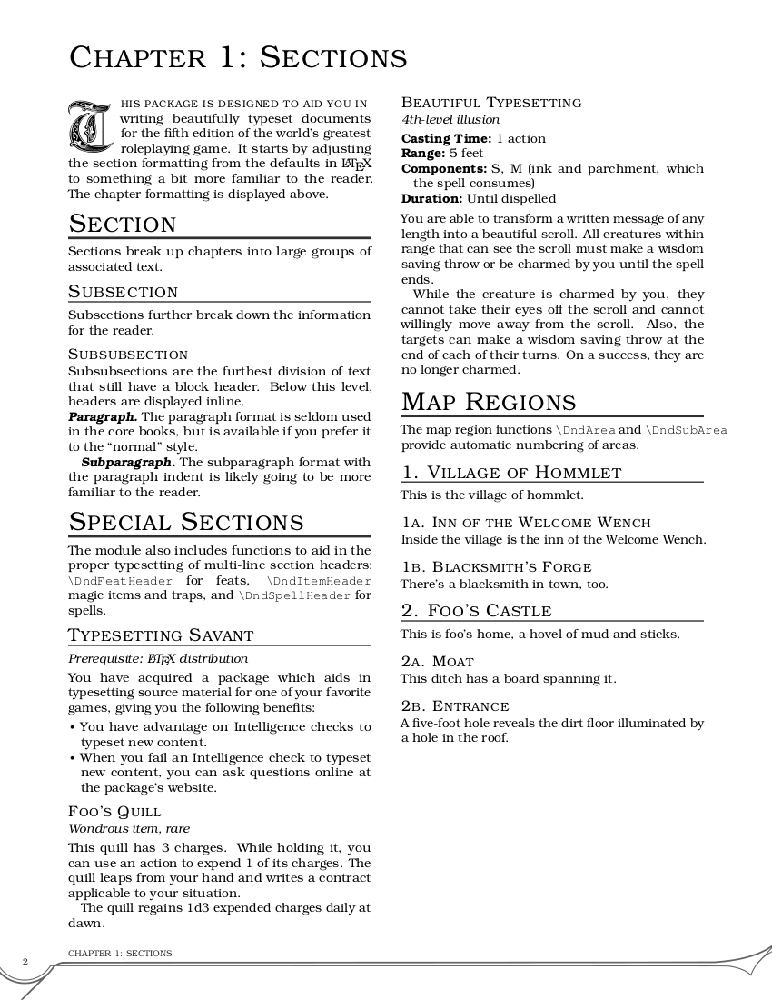

# TTRPG LaTeX Template

This is a LaTeX template based on [DND-5e-LaTeX-Template](https://github.com/rpgtex/DND-5e-LaTeX-Template).

## Features

* Higher-contrast and more print-friendly than DND-5e-LaTeX-Template.
* TeX Live includes the default fonts.
* Works with pdfTeX, LuaTeX, and XeTeX.



## Installation

Clone this repository to `$TEXMFHOME/tex/latex/`:

```sh
git clone https://github.com/rpgtex/DND-5e-LaTeX-Template.git "$(kpsewhich -var-value TEXMFHOME)/tex/latex/dnd"
```

Please refer to [rpgtex/DND-5e-LaTeX-Template](https://github.com/rpgtex/DND-5e-LaTeX-Template) for more information about installing this package.

### Project install using `TEXINPUTS`

You can also clone a copy of the repository to each LaTeX project. For example, to clone the repository to a `lib/` directory in your project:

```sh
mkdir lib/
git clone https://github.com/rpgtex/DND-5e-LaTeX-Template.git lib/dnd
```

LaTeX will not find the template automatically. Set `TEXINPUTS` when compiling your project to locate the package:

```sh
TEXINPUTS=./lib//: pdflatex project.tex
```

## Usage

Please refer to [rpgtex/DND-5e-LaTeX-Template](https://github.com/rpgtex/DND-5e-LaTeX-Template) for more information about using this package.

### Class (recommended)

Load the `dndbook` class in your preamble:

```tex
\documentclass[10pt,twoside,twocolumn,openany,nodeprecatedcode]{dndbook}

\usepackage[english]{babel}
\usepackage[utf8]{inputenc}

\begin{document}
% ...
```

### Package

You can also load the `dnd` package directly to use it with another class.
Note that the package has only been tested with the `book` class.

```tex
\documentclass[10pt,twoside,twocolumn,openany]{book}

\usepackage[english]{babel}
\usepackage[utf8]{inputenc}

\usepackage[layout=true]{dnd}

\begin{document}
% ...
```

## Dependencies

If you don't have LaTeX installed, it is recommended that you install a complete [TeX Live distribution](https://www.tug.org/texlive/).

Please refer to [rpgtex/DND-5e-LaTeX-Template](https://github.com/rpgtex/DND-5e-LaTeX-Template) for more information about TeX Live.

## Known issues and solutions

Please refer to [rpgtex/DND-5e-LaTeX-Template](https://github.com/rpgtex/DND-5e-LaTeX-Template) for more information about known issues.

## Credits

* DND-5e-LaTeX-Template background image from [Lost and Taken](https://lostandtaken.com/)

## License

MIT
